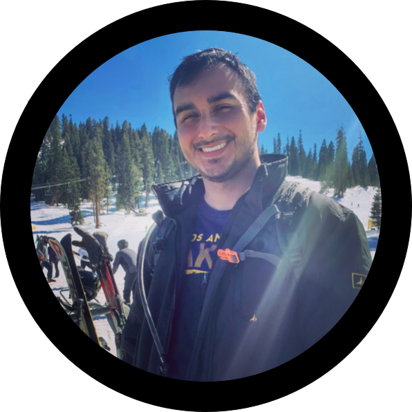

**Hi, my name is Oliver. 👋**

**I work as a back end developer for Secureworks in the San Francisco Bay Area.**

**Outside of work, I'm a computer/tech geek, an avid basketball fan, and an outdoor enthusiast who enjoys mountain biking, hiking, and rock climbing.**

**My inbox is always open, so feel free to [shoot me an email](mailto:olivermdelgado.github@gmail.com) if you want!\
Or maybe you just want to [connect on LinkedIn](https://www.linkedin.com/in/olivermdelgado/)?** ¯\\\_(ツ)\_/¯
* * *
## Education
**Texas A&M University**\
**Bachelor of Science in Computer Engineering • Minor in Applied Mathematics**\
**May 2018**

* * *

## Experience
### Secureworks • Software Engineer • May 2019-Current
* Backend API developer using Go, GraphQL, and Kubernetes to develop micro services for our [Taegis XDR SaaS offering](https://docs.ctpx.secureworks.com/at_a_glance/).
* Advocate and promote clean code practices, code reviews, unit testing, and documentation.
* Regularly develop and integrate with 3rd party services and APIs (DataDog, Salesforce, AWS, etc).
* Developed internal accountability tools.
    * Architected and developed an 'open source compliance' CICD tool to ensure proper license usage in our 3rd party dependencies.
    * Generated reports for DataDog that track monitors/alerts and their metadata (meant to track which monitors are missing outage runbooks links).
    * Generated reports for open PRs, aggregating data on PR age, contributors, and recent activity (meant to track PRs at risk of getting stale).
* Additional past work includes:
    * [Developed back end API logic for our product's 'incident response' times](https://docs.ctpx.secureworks.com/dashboard/response_time/) (meant to showcase our product's impact on the timeliness of event handling).
    * Refactored REST endpoints to be GraphQL endpoints on [several high traffic APIs](https://docs.ctpx.secureworks.com/apis/using_collector_api/). Thoughtful refactoring resulted in significantly reduced response times for many endpoints through the use of selective and eager/lazy loaded data.

### IBM Cloud • Software Engineer • May 2018-May 2019
* Worked daily with clients as a 'solutions engineer' to onboard their products onto IBM Cloud.
    * Developed and documented custom client solutions to promote 'cloud native' patterns and standards.
    * Aided in re-deployment of client legacy components with their cloud native equivalent offerings found on the IBM Cloud platform.
    * Automated the provisioning and configuration of client solutions with Terraform.
* Contributed to architecture and development of an internal tool to track key performance metrics for IBM Cloud product offerings.
    * Collected, visualized, and analyzed resulting data to assess performance of IBM Cloud's product offerings.
    * Led competitive analysis effort to compare performance of equivalent offerings from our cloud competitors.
* Developed smaller internal tools to facilitate the team's day to day operations.
    * Designed synchronization tool to manage Agile tickets and corresponding GitHub tickets.
* Conducted exploratory work on new IBM Cloud offerings to evaluate and document the product app experience and functionality. Findings were reported to PMs, providing feedback about bugs and possible improvements for future releases.

### IBM Verse • Software Engineering Intern • Summer 2017
* Developed code for IBM’s Verse app, deployed to over 700K active users following an agile-based continuous integration and delivery (CICD) development process.
* Implemented dark feature toggle ability that allows for new features to be toggled on and off in their alpha/beta and production channels, helping to promote the CICD process. This new feature included both a scheme (URL) based access model as well as a UI enabling the user to toggle features in real time. 
* Prototyped native Android analytic integration leveraging the New Relic Analytics SDK to gather critical Android application data from Verse app and visualized that data via New Relic analytic cloud queries. 

### Texas A&M University • Undergraduate Research Assistant • Aug 2016-May 2017
* I participated in an research effort to promote light energy efficiency by automating the energy audit process under the supervision of Dr. Bryan Rasmussen. 
* Developed Python and C++ programs using Open_CV image recognition libraries to identify light type, shape, and placement. Data was used in tandem with odometry readings to map light locations onto a generated floor plan. 
* Led software team and cross-collaborated with several other undergraduate students on a multidisciplinary engineering team to develop an autonomous robot capable of analyzing and processing the light data in a room.
 
* * *

## Projects
**I have so many sticky notes full of ideas that I want to pursue. One day I'll get to all of them :-)**  

**In the meantime, below are some of my favorite side projects:**

### [URL Shortener with click-through tracking](https://github.com/olivermdelgado/shorty_url)
* An API that converts a URL to a 'short link' URL to send to friends. Additionally, it determines when and how many times the link was clicked. Using request metadata, it can attempt to determine unique clicks.
* **Technologies used:** Go, Docker, Redis, PostgresQL
	
### [Reddit post tracker](https://github.com/olivermdelgado/scanny)
* A script that sends a notification when certain keywords are matched in a new post for a given subreddit.
* **Technologies used:** Go, Docker, Reddit API, Telegram API

### Suspicious login detection API (coding challenge)
(Okay so this was not a _real_ personal project but rather a coding challenge given to me by a company during their interview process. It was the first Go program I ever wrote and it has a special place in my heart! 🙂)
* An API that tracks 'login' attempts and flags a login as 'suspicious' based on IP geolocation, duration lengths between subsequent logins, etc.  
* **Technologies used:** Go, Docker, SQL

* * *

## Skills
**Languages:** Go, Python

**Tools:** Kubernetes, Docker, Grafana, Prometheus, Terraform, Git, Bash

**General:** API Development, Cloud Development, SQL, Data Analysis, Scripting & Automation
